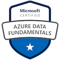

# Hi there, my name is Peter O'Connor 👋
I'm a Software Engineer at Rolls-Royce Digital working in Derby, UK.

// TODO - Add an interesting, witty bio...😄

## How to find me 🌍

## My Particulars 🔍

## Certs 🎉

## P.S. 👀
- 🔨 I’m currently working on a JAM Stack E-Commerce Project using Strapi, Snipcart & Gatsby
- 📊 I enjoy data visualisation and recently got an honourable mention at the [Pudding Cup awards for 2021](https://pudding.cool/process/pudding-cup-2021/) for my project on the [decline of the song intro](https://poc275.me/death-of-the-song-intro/)
- 💡 I’m currently learning about MLOps and Rust/Web Assembly

(⚡ Powered by Tea ☕)

<!--
**Poc275/poc275** is a ✨ _special_ ✨ repository because its `README.md` (this file) appears on your GitHub profile.

Here are some ideas to get you started:

- 🔭 I’m currently working on ...
- 🌱 I’m currently learning ...
- 👯 I’m looking to collaborate on ...
- 🤔 I’m looking for help with ...
- 💬 Ask me about ...
- 📫 How to reach me: ...
- 😄 Pronouns: ...
- ⚡ Fun fact: ...
-->
